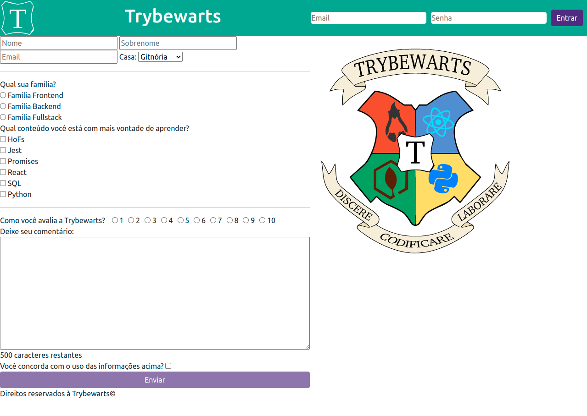

# Projeto Trybewarts!

Boas-vindas, neste projeto de avaliação prática, utilizei todo o conhecimento adquirido na seção 6 do curso de Desenvolvimento Web da Trybe.
Esse projeto se trata de  uma página de formulário da Escola de Magia de Trybewarts, em que as pessoas estudantes poderão enviar seus feedbacks sobre ela. 



## Ferramentas


---

## Habilidades

- Criar formulários em HTML;
- Utilizar CSS Flexbox para criar layouts flexíveis;
- Criar regras CSS específicas para serem aplicadas a dispositivos móveis;
- Construir páginas que alteram o seu layout de acordo com a orientação da tela;


---

# 🔨 Funcionalidades do projeto
Uma página web que simula um formulário de avaliação.

</br>


## 📁 Acesso ao projeto

clone este repositório:

```sh
git clone git@github.com:SamuelR499/trybewarts.git
```

acesse o repositório clonado

```sh
cd trybewarts
```

Instale as dependências

```sh
npm install
```

</br>

vc pode usar a extensão do VsCode [LiveServer](https://github.com/ritwickdey/vscode-live-server) para executar o `index.HTML` em um navegador.

---

## Entrega

  - `1` dia de projeto.
  - Data do ultimo commit durante o desenvolvimento do projeto: `07/04/22`.
